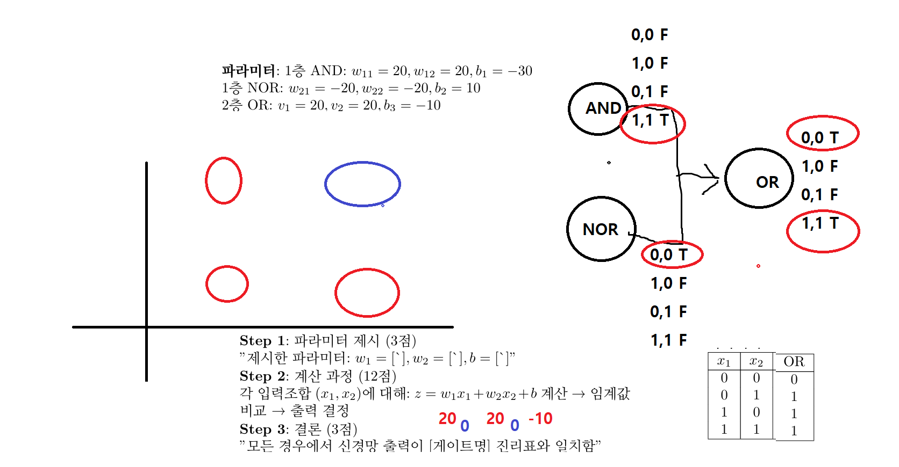

# 인공지능 기말고사 치팅페이퍼

2025년 6월 19일 인공지능 기말고사용 치팅페이퍼. A4 양면 허용 시험이라서 LaTeX로 최대한 많은 내용을 압축해서 정리했다.

## 내용

### 다룬 주제들
- **기초 수학**: 선형대수(행렬, 정사영), 확률론, 정보이론(엔트로피, BCE)
- **신경망 기초**: 퍼셉트론, 순전파/역전파(체인룰), 활성화 함수, 손실함수
- **논리게이트**: AND, OR, XOR/XNOR 신경망 구현, 선형분리 불가능성
- **CNN**: LeNet 구조 분석, ResNet(Skip Connection), 1×1 Convolution
- **Transformer**: Self-Attention, Multi-Head Attention, Positional Encoding
- **Language Models**: BERT vs GPT 비교, MLM, Auto-regressive
- **Vision Transformer**: ViT vs CNN, Swin Transformer (윈도우 기반 attention)
- **Neural Style Transfer**: Content/Style Loss, Gram Matrix
- **Adversarial ML**: FGSM, PGD 공격, Adversarial Training
- **고급 주제**: LoRA, GAN, 멀티모달(LLaVA), Transfer Learning

### 논리게이트 신경망 구현
단층 퍼셉트론으로 구현 가능한 게이트들과 XOR가 선형분리 불가능한 이유를 수학적으로 증명했다. 실제 시험에서 AND, OR, XNOR 구현 문제가 나와서 이 부분이 특히 유용했다.



### LaTeX 작업
- 6pt 폰트, 3단 컬럼으로 컴팩트하게 설계
- kotex 패키지로 한글 지원
- amsmath로 복잡한 수식 표현

## 파일 구조

```
├── README.md                           
├── ai-cheat-sheet.tex                  # LaTeX 소스파일
├── ai-cheat-sheet.pdf                  # 컴파일된 PDF
├── assets/
│   └── logic-gates-neural-network.png  # 논리게이트 다이어그램
└── .gitignore                          
```

## 사용법

Overleaf에서 컴파일하는 경우:
1. [Overleaf](https://ko.overleaf.com)에 LaTeX 파일 업로드
2. 컴파일러를 pdfLaTeX로 설정
3. kotex 패키지가 포함되어 있는지 확인

로컬에서 컴파일하는 경우:
```bash
pdflatex ai-cheat-sheet.tex
```

## 제작 과정

ICPC 팀노트를 만들어본 경험이 있어서 LaTeX에 어느 정도 익숙했다. 
15주차 강의 내용을 체계적으로 분석하고, A4 양면에 최적화된 
레이아웃으로 압축 정리했다. 6pt 폰트와 3단 컬럼 구조로 
가독성을 유지하면서도 최대한 많은 정보를 담았다.

## 시험 정보

- 시험일: 2025년 6월 19일 오후 4시
- 형식: A4 양면 치팅페이퍼 허용
- 문제 구성: 객관식 40문제 + 주관식 6문제
- 객관식 특징: 4지선다, 답이 2개 이상일 수 있음, 부분점수 없음
- 시험 범위: 중간고사 범위 포함 15주차 전체 (누적 시험)
- 계산기: 지참 가능 (실제로는 512×8 정도만 계산, 체인룰 계산 문제 없음)

## 실제 출제된 문제들

### 주관식
- FGSM과 PGD의 수학적 연관성 설명
- PGD 알고리즘 작성
- 논리게이트 신경망 구현 문제들 (모두 같은 답안 형식)
  - OR 게이트 신경망 구현 (파라미터 제시)
  - AND 게이트 신경망 구현 (파라미터 제시)  
  - XNOR 게이트 신경망 구현 가능 여부 및 이유
  - 답안 형식: `x_1=0, x_2=0 -> (중간과정) -> output : 1`
  - 단일층 퍼셉트론 제약 없음, sigmoid 활성화 함수 주어짐
  - XNOR은 2층 퍼셉트론 구조(NOR + AND -> OR)로 해결 가능
  - XNOR 문제는 중간고사에서 출제오류로 전원정답 처리됐던 문제 재출제

### 객관식 주요 주제
- BERT, GPT 모델 관련
- BLIP 논문 내용
- Attention Is All You Need 논문
- FGSM, PGD adversarial attack
- Convolution 연산 크기 계산
- 수업 중 다룬 Colab 실습 코드 분석
- 강의 슬라이드(PPT/PDF) 내용 기반 문제들

### 도움이 된 참고 자료
- [Adversarial ML Tutorial - Introduction](https://adversarial-ml-tutorial.org/introduction/)
- [Adversarial ML Tutorial - Adversarial Examples](https://adversarial-ml-tutorial.org/adversarial_examples/)
- [LeNet PyTorch Implementation](https://colab.research.google.com/github/bentrevett/pytorch-image-classification/blob/master/2_lenet.ipynb)

FGSM, PGD 공격 방법과 LeNet 구조 계산이 이 자료들에서 직접 출제됐다. 논리게이트 문제들도 재출제로 나와서 치팅페이퍼가 꽤 도움이 되었다.
